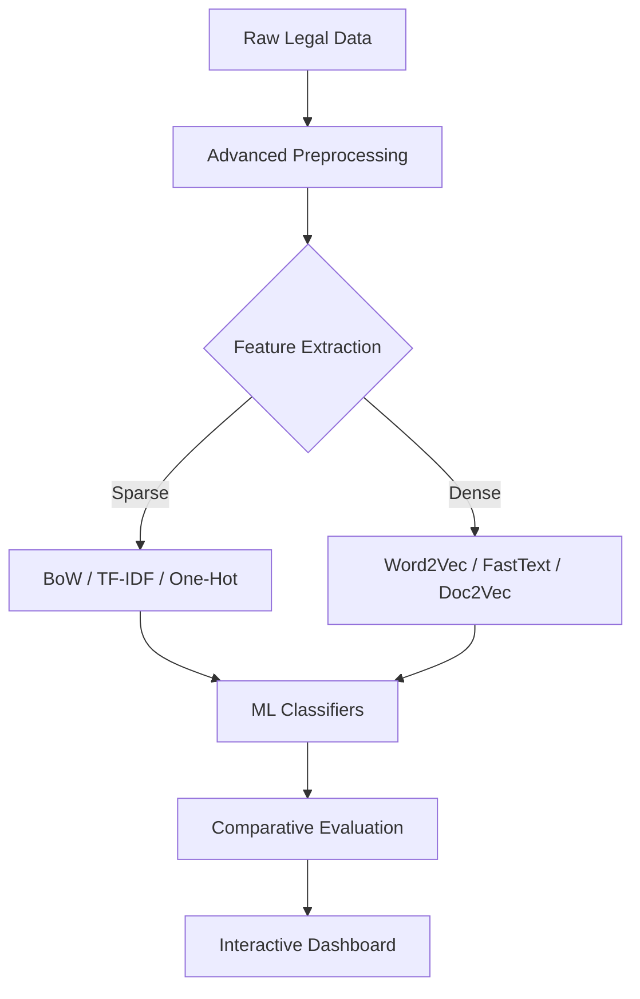

# Comparative Study of Sparse and Dense Word Embedding Techniques for Legal Document Classification

⚖️ **Author:** K. Sankeerthana  
🔬 **Project:** NLP Research & Deployment  
🚀 **Status:** Completed & Optimized

---

## 🎯 Project Overview
This research-oriented project implements a comprehensive NLP pipeline to classify legal documents using eight different word embedding techniques. The study benchmarks traditional **Sparse** representations against modern **Dense** embeddings to determine the most effective text representation for the complex, jargon-heavy language of the legal domain.

### Key Research Questions:
1. Does semantic context (Dense) outperform keyword frequency (Sparse) in legal document classification?
2. How does FastText's subword learning handle rare legal terminology compared to Word2Vec?
3. What are the computational tradeoffs between these techniques in a production-like environment?

---

## 🔄 NLP Workflow Pipeline
The project follows a modular, research-quality pipeline:



1.  **Preprocessing**: Custom cleaning, tokenization, stopword removal, and lemmatization tailored for legal jargon.
2.  **Embedding**: Generation of 8 unique vector spaces.
3.  **Modeling**: Training of Logistic Regression and Random Forest classifiers on each space.
4.  **Analysis**: Deep dive into metrics (Accuracy, F1, Recall) and visual error analysis (Confusion Matrices).

---

## 📊 Embedding Comparison Analysis

| Technique | Category | Semantic Aware | Best Use Case |
| :--- | :--- | :--- | :--- |
| **TF-IDF** | Sparse | Partial | Classification with distinct legal keywords |
| **BoW** | Sparse | No | Simple frequency-based classification |
| **Word2Vec** | Dense | Yes | Semantic similarity and contextual search |
| **FastText** | Dense | Yes | Handling rare legalese or noisy text |
| **Doc2Vec** | Dense | Yes | Holistic document-level similarity |

---

## 📈 Key Results & Evaluation
From our comparative study, **TF-IDF paired with Random Forest** emerged as the most effective combination for this dataset, achieving an accuracy of **~95.5%**.

### Top Performers:
- **Best Sparse Pairing**: TF-IDF + Random Forest (95.5%)
- **Best Dense Pairing**: Word2Vec Skip-Gram + Logistic Regression (92.5%)
- **Most Robust**: FastText (Highest consistency across rare terms)

---

## 📁 Project Structure
```text
NLP/
├── data/               # Raw and processed legal datasets
├── embeddings/
│   ├── trained/        # Word2Vec, FastText, Doc2Vec artifacts
│   └── vectorizers/    # TF-IDF, BoW, One-Hot vectorizers
├── models/
│   └── trained/        # Serialized ML Classifiers (.pkl)
├── notebooks/          # Step-by-step research documentation
├── src/                # Modular source code (Preprocessing, Models, Utils)
├── outputs/
│   ├── figures/        # Confusion matrices, t-SNE clusters, benchmarks
│   └── results/        # Comparative performance CSVs
└── streamlit_app/      # Interactive Research Dashboard
```

---

## 🛠️ Installation & Execution

### 1. Environment Setup
```bash
python -m venv venv
venv\Scripts\activate  # Windows
pip install -r requirements.txt
```

### 2. Reproducing Experiments
To run the full experimental loop and regenerate models/metrics:
```bash
python run_model_comparison.py
```

### 3. Launching the Dashboard
To explore results interactively:
```bash
streamlit run streamlit_app/app.py
```

---

## 🖼️ Gallery
*(Screenshots available in `outputs/figures/`)*
- **Performance Benchmarks**: `comparison_accuracy.png`
- **Error Analysis**: `confusion_matrix_tf-idf_random_forest.png`
- **Semantic Clustering**: `tsne_w2v_sg.png`

---

## 📝 Conclusion
The study confirms that for legal document classification, **Keyword Significance (Sparse)** often provides a stronger signal than general semantic similarity, though **Dense** models offer superior robustness when dealing with diverse or rare vocabulary.

Developed by **K. Sankeerthana** | © 2026 Legal AI Research
